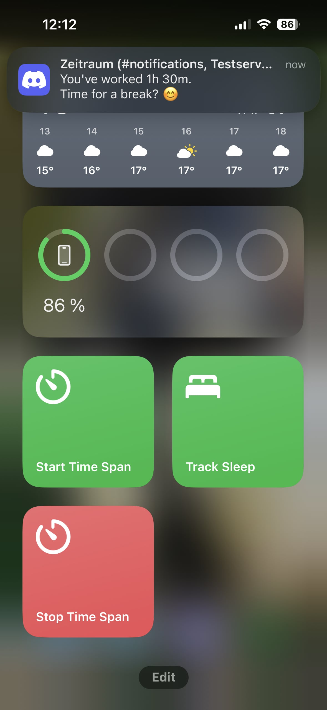

# iOS, macOS & watchOS Shortcuts

**Download:**

- [Start time span with tags](https://www.icloud.com/shortcuts/383391567d4c4cbfa0b0ff610d252c88)

- [Stop currently running time span](https://www.icloud.com/shortcuts/b79517313dc842578e20729a656dca66)

The Apple Shortcuts app allows to track time everywhere on your Apple devices without requiring an app.
Shortcuts are also great to automate your time tracking. For example:

- Start time span for tracking your sleep, when your sleep focus is enabled
- Start time span for travel time, when you leave your home
- Start time span for work, when you enter the office building

Zeitraum provides two shortcuts. They can also give you an idea how to integrate Zeitraum further into your workflows.

When added, you need to enter the server URL and API token of your Zeitraum server.
It's important to enter the URL with the `/graphql` path, for example:

```
https://your-zeitraum.com/graphql
```

> **Tip:** You can chain these two shortcuts to first stop the running time span and then start a new one. Just edit the `Start time span` shortcut and prepend a `Run Shortcut` action that invokes the stop shortcut


