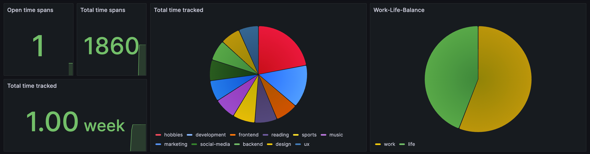

# My Workflow

Zeitraum is very DIY. This should give inspiration on how I personally use Zeitraum to keep track of my own work life balance, what other tools I use and how great they integrate with Zeitraum.

## Deployment

The Zeitraum server is deployed via Docker Compose on a server. I have it secured with Traefik as reverse proxy which also equips it with a valid SSL certificate.

Read more about the [deployment of a Zeitraum server](../packages/server/README.md#docker-compose).

## Time Tracking

### My Tags

I'm rather specific with my tags and try to reuse tags as much as possible, because that way it can be calculated and aggregated more easily. I mainly think about what I want to know in the end, what questions do I want to answer.

Here are some of the time spans I usually track

- **`work`, `meeting`** - I don't need to know what specific meeting, but the time spent in meetings is interesting
- **`work`, `development`** - Writing code for work, not being specific here either.
- **`life`, `hobby`, `photography`** - Hobby nicely bundles all my hobbies. Life allows to top-level separate work from life and creates a work/life balance overview in the end.
- **`life`, `entertainment`, `youtube`** - Oddly specific, but I thought I want to separate the kind of entertainment.

### Apple Shortcuts

I track time on my iPhone when I'm on the go and at home when I'm not by my computer.

Here I have predefined shortcuts for activities, like `Cooking`, `Sleep`, `Travel`, `Shopping`, etc. These activities then have multiple tags assigned based on the layout described above.

> Check the Sleep tracking example Shortcut for details: [Apple Shortcuts](./apple-shortcuts.md)

I'm not using any Shortcut Automations yet, but I have some ideas for the future here.

### Elgato StreamDeck & Zeitraum CLI

On Mac I mainly use the StreamDeck to track time. Here I use the [`Run OSA script` plugin](https://github.com/gabrielperales/streamdeck-osascript) with an AppleScript that invokes the [Zeitraum CLI](../packages/cli/README.md).

```AppleScript
# Stop previous time span (if running) and start new one
on run
	set command to "zeitraum stop; zeitraum track work development"
	do shell script command
end run
```

This way I have multiple buttons to quickly start tracking time. It's incredibly convenient to use.

## Grafana

I have a Grafana, Prometheus & Alertmanager setup in my Homelab anyways. Now I also use it to keep an eye on where I spent my time. This is still work in progress.

This is the dashboard right now, but I want to extend it with a view on time tracked today and the week.

[Learn how to configure Prometheus and Zeitraum](./packages/server/README.md#prometheus)


